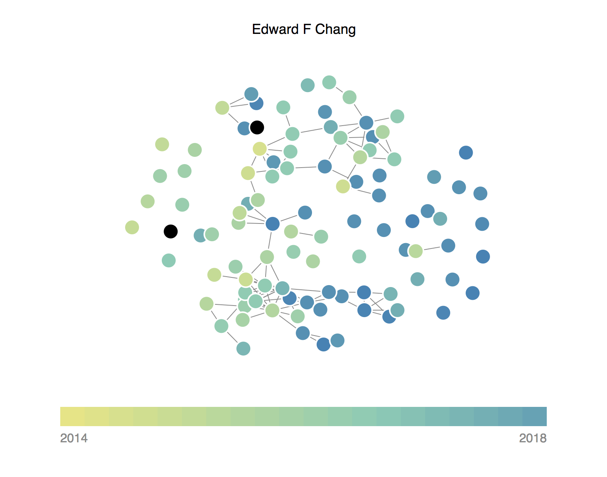

# Pubviz
Visualize a scientist's entire publication history and see how papers cluster into topics of research.

Check it out at [pubviz.com](http://pubviz.com)!

Below is the visualization when you search for my PhD thesis adivor, a neurosurgeon who also studies speech perception and production. His publications cluster into two main groups, those related to epilepsy and neurosurgery and those related to speech.
 

This web app is built using [Python3](https://docs.python.org/3/) and [aiohttp](http://aiohttp.readthedocs.org/en/stable/), enabling asynchronous calls to the [PubMed](http://www.ncbi.nlm.nih.gov/pubmed) API to get the full text of a scientist's abstracts.

The text of the abstracts is then processed using [nltk](http://www.nltk.org/), [scikit-learn](http://scikit-learn.org/stable/), and [scipy](http://www.scipy.org/) to compute a similarity matrix, which is then visualized as a force-directed graph implemented using [d3.js](http://d3js.org/). Each node represents a paper, and edges link papers that have similar topics.

